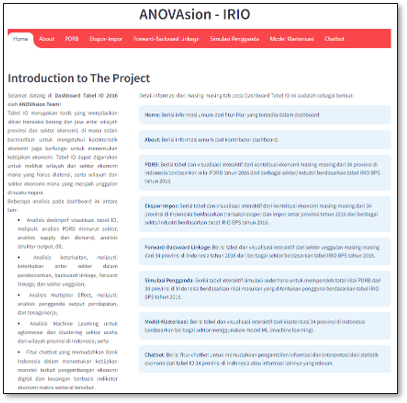
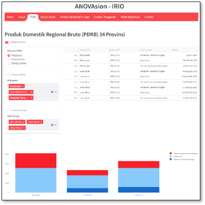
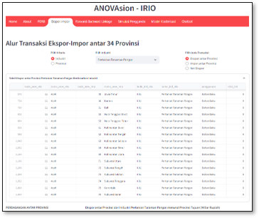
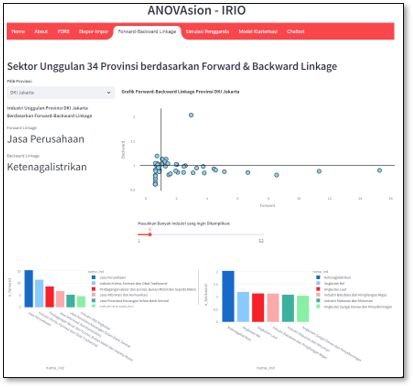
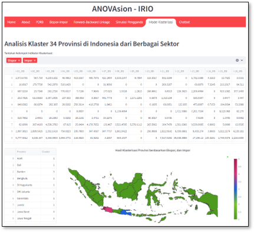
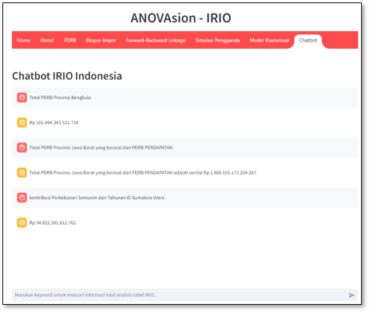

# Welcome to IRIOdashboard 👋

**An analytical dashboard for IRIO (Inter-Regional Input Output) table.**

## 💸 Apa itu IRIOdashboard?

IRIOdashboard adalah sebuah aplikasi berbasis web interaktif yang menyajikan informasi dan analisis ekonomi wilayah di seluruh provinsi di Indonesia. Beberapa fitur yang disediakan dalam aplikasi ini, seperti:

- **Visualisasi analisis deskriptif** tabel IRIO meliputi analisis PDRB menurut sektor, analisis supply dan demand, analisis struktur output, dan sebagainya;
- **Analisis keterkaitan** meliputi keterkaitan antar sektor ekonomi, backward linkage, forward linkage, dan sektor unggulan;
- **Analisis Multiplier Effect** meliputi analisis pengganda output, pendapatan, dan tenaga kerja;
- **Analisis Machine Learning** untuk aglomerasi dan klastering sektor usaha dari wilayah provinsi di Indonesia;
- **Chatbot** untuk mendukung proses pencarian informasi seputar ekonomi regional di Indonesia.

IRIOdashboard adalah aplikasi yang mudah diakses dan powerful.

## 📌 Quickstart

Clone repository dengan perintah:

```
git clone https://github.com/ANOVAsion/IRIOdashboard.git
```

Install library yang dibutuhkan pada lingkungan python Anda:

```
pip install -r requirements.txt
```

Lalu jalankan untuk membuka IRIOdashboard

```
$ streamlit run stream.py
```

## 🗡️ Ekosistem Pengembangan

- [plotly](https://plotly.com/)
- [Streamlit](https://docs.streamlit.io/)
- [LLMs & chatbot apps](https://streamlit.io/gallery?category=llms)
- [OpenAI](https://openai.com/)
- [scikit-learn](https://scikit-learn.org/)

## 📄 Dokumentasi

Berikut ini adalah dokumentasi singkat

<table border="0">
  <tr>
    <td>
      <a target="_blank" href="https://anovasion-irio.streamlit.app">
        
      </a>
    </td>
    <td>
      <a target="_blank" href="https://anovasion-irio.streamlit.app">
        
      </a>
    </td>
    <td>
      <a target="_blank" href="https://anovasion-irio.streamlit.app">
        
      </a>
    </td>
    <td>
      <a target="_blank" href="https://anovasion-irio.streamlit.app">
        
      </a>
    </td>
    <td>
      <a target="_blank" href="https://anovasion-irio.streamlit.app">
        
      </a>
    </td>
    <td>
      <a target="_blank" href="https://anovasion-irio.streamlit.app">
        
      </a>
    </td>
  </tr>
  <tr>
    <td>beranda</td>
    <td>PDRB</td>
    <td>ekspor-impor</td>
    <td>linkage</td>
    <td>klaster</td>
    <td>chatbot</td>
  </tr>
</table>

Please check it out for the most up-to-date tutorials, how-to guides, references, and other resources!

## 😺 ANOVAsion Developer

1. [Alfa](https://github.com/alfanugraha)
2. [Dhea](https://github.com/DheaDewanti)
3. [Mida](https://github.com/nurkhamidah)
4. [Teguh](https://github.com/teguhprasetyo08)

## 📖 Referensi

1. Badan Pusat Statistik. 2019. Pengenalan Data Dasar PPRK: Tabel Input-Output.
2. C. Chong et al., “A visualizasion method of the economic input–output table: Mapping monetary flows in the form of Sankey diagrams,” Sustain., vol. 13, no. 21, pp. 1–56, 2021, doi: 10.3390/su132112239.
3. BPS-Statistics Indonesia, “Input Output Table of Indonesia 2016 (in Bahasa),” 2021, [Online]. Available: https://www.bps.go.id/id/publicasion/2021/03/31/081f6b0af2c15c524d72b660/tabel-input---output-indonesia-2016.html

## 🔐 Kerentanan Keamanan

Jika Anda menemukan kerentanan keamanan pada IRIOdashboard, silakan email ke Alfa via [afanugraha@apps.ipb.ac.id].

## 📄 Lisensi

IRIOdashboard dibangun menggunakan Streamlit yang berbasis _open-sourced software_ dengan lisensi di bawah [MIT license](https://opensource.org/licenses/MIT).
